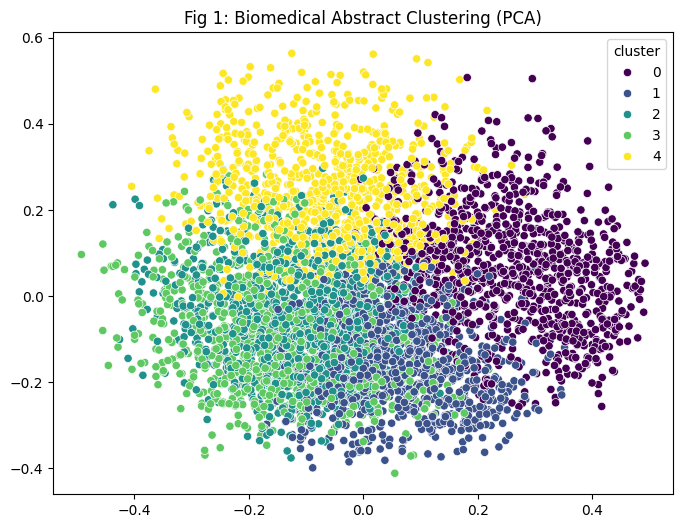
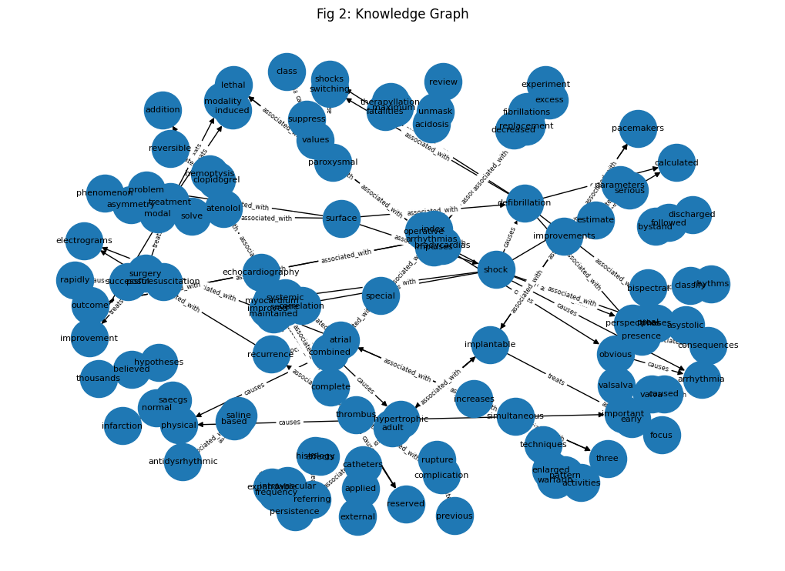
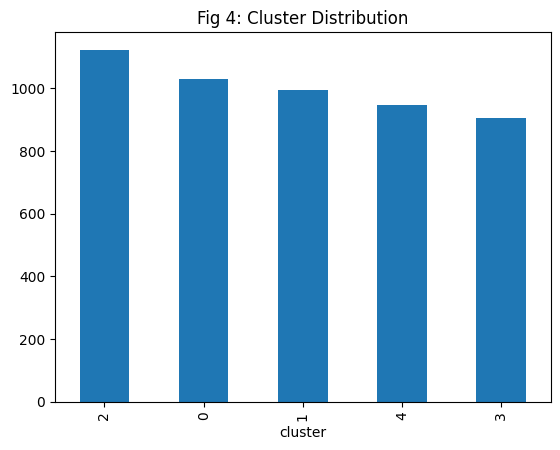
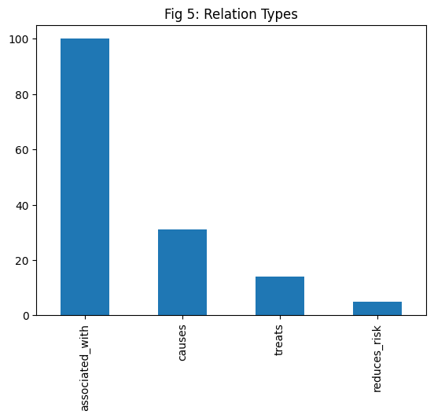

# 🫀 NLP Pipeline for Cardiovascular Biomedical Literature
### Named Entity Recognition · Knowledge Graph · Semantic Clustering · Relation Extraction

[](https://www.python.org/)
[](https://huggingface.co/)
[](https://colab.research.google.com/)
[](LICENSE)
[]()

> **A complete NLP pipeline applied to 5,000 cardiovascular biomedical abstracts — extracting named entities, building a knowledge graph, clustering documents by semantic similarity, and evaluating with precision/recall metrics.**

---

## 📋 Table of Contents
- [Overview](#overview)
- [Pipeline Architecture](#pipeline-architecture)
- [Results](#results)
- [Dataset](#dataset)
- [How to Run](#how-to-run)
- [Output Figures](#output-figures)
- [Methods Summary](#methods-summary)
- [Authors](#authors)

---

## Overview

This project applies a complete Natural Language Processing pipeline to **5,000 cardiovascular biomedical research abstracts** from the Cardio_v1 dataset. The pipeline performs:

- **Biomedical NER** using `d4data/biomedical-ner-all` (HuggingFace transformer)
- **Semantic clustering** using `sentence-transformers/all-MiniLM-L6-v2` + K-Means (k=5)
- **Relation extraction** using zero-shot classification (`valhalla/distilbart-mnli-12-3`)
- **Knowledge graph construction** using NetworkX with 4 relation types
- **Evaluation** using fuzzy semantic matching with cosine similarity

**Key findings:**
- ✅ `5,000 abstracts` processed from cardiovascular literature
- ✅ Top entity: `fibrillation` (268 mentions) — confirming cardiac arrhythmia focus
- ✅ `5 semantic clusters` identified with ~900–1,100 documents each
- ✅ Knowledge graph with `100+ associated_with`, `31 causes`, `14 treats` relations
- ✅ NER evaluated with precision/recall using semantic similarity threshold = 0.7

---

## Pipeline Architecture

```
┌──────────────────────────────────────────────────────────────────┐
│              NLP CARDIOLOGY PIPELINE                              │
├──────────┬──────────────┬──────────────┬──────────┬─────────────┤
│ Stage 1  │   Stage 2    │   Stage 3    │ Stage 4  │   Stage 5   │
│  Data    │  Text Clean  │  Biomedical  │ Semantic │  Knowledge  │
│  Load    │  & Preproc   │    NER       │ Cluster  │   Graph     │
├──────────┼──────────────┼──────────────┼──────────┼─────────────┤
│ CSV load │ Lowercase    │ d4data/      │ MiniLM   │ Zero-shot   │
│ 5000 row │ Remove punct │ biomedical   │ sentence │ relation    │
│ Title +  │ Stop word    │ -ner-all     │ embeddi  │ extraction  │
│ Abstract │ removal      │ HuggingFace  │ ngs      │ 4 rel types │
│ merge    │ Tokenize     │ transformer  │ KMeans   │ NetworkX    │
│          │              │              │ k=5, PCA │ DiGraph     │
└──────────┴──────────────┴──────────────┴──────────┴─────────────┘
```

---

## Results

### Fig 1: Biomedical Abstract Clustering (PCA)
5 semantically distinct clusters identified from 5,000 abstracts using sentence embeddings + K-Means. PCA reduces 384-dimensional embedding space to 2D for visualization.



### Fig 2: Knowledge Graph
Directed graph showing medical entity relationships extracted by zero-shot classification. Nodes = medical entities, edges = relation type (associated_with, causes, treats, reduces_risk).



### Fig 3: Top Entities
Most frequent biomedical entities extracted by the NER model from 1,000 abstracts.

| Rank | Entity | Count | Clinical Significance |
|------|--------|-------|----------------------|
| 1 | fibrillation | 268 | Most common arrhythmia studied |
| 2 | ventricular | 230 | Heart chamber focus |
| 3 | atrial | 202 | Atrial fibrillation research |
| 4 | cardiac | 148 | General cardiac events |
| 5 | arrhythmias | 145 | Rhythm disorders |
| 6 | arrhythmia | 107 | Synonym variant |
| 7 | induced | 95 | Drug-induced arrhythmia |
| 8 | hospital | 94 | Clinical setting |


### Fig 4: Cluster Distribution
Balanced cluster sizes (~900–1,100 docs each) confirm the K-Means model found genuine semantic structure rather than one dominant topic.



### Fig 5: Relation Types
Distribution of extracted biomedical relations. `associated_with` dominates (100 instances), followed by `causes` (31), `treats` (14), and `reduces_risk` (6).



---

## Dataset

| Parameter | Value |
|-----------|-------|
| Source | Cardio_v1.csv (Google Drive) |
| Domain | Cardiovascular biomedical literature |
| Records | 5,000 abstracts (title + abstract merged) |
| Fields | title, abst (abstract) |
| Language | English |
| NER subset | 1,000 abstracts |
| Relation subset | 50 abstracts |
| Evaluation subset | 10 abstracts with gold labels |

---

## How to Run

### Option A — Google Colab (recommended)
1. Upload `Final_Project.ipynb` to Google Colab
2. Upload `Cardio_v1.csv` to your Google Drive at `MyDrive/Cardio_v1.csv`
3. Run all cells in order

### Option B — Local Jupyter
```bash
pip install pandas numpy matplotlib seaborn scikit-learn networkx nltk
pip install transformers torch sentence-transformers
jupyter notebook Final_Project.ipynb
```
Update the file path:
```python
df = pd.read_csv("path/to/Cardio_v1.csv", nrows=5000)
```

### Models used (downloaded automatically)
```python
# Biomedical NER
ner_pipeline = pipeline("ner", model="d4data/biomedical-ner-all")

# Sentence embeddings for clustering
embedder = SentenceTransformer("sentence-transformers/all-MiniLM-L6-v2")

# Zero-shot relation extraction
rel_model = pipeline("zero-shot-classification", model="valhalla/distilbart-mnli-12-3")
```

---

## Output Figures

| Figure | Description |
|--------|-------------|
| `fig1.png` | PCA scatter plot — 5 semantic clusters of biomedical abstracts |
| `fig2.png` | Knowledge graph — entities connected by relation types |
| `fig3.png` | Bar chart — top 10 most frequent biomedical entities |
| `fig4.png` | Bar chart — cluster size distribution (balanced ~1,000 each) |
| `fig5.png` | Bar chart — relation type distribution |

---

## Methods Summary

| Step | Method | Library / Model |
|------|--------|----------------|
| Text cleaning | Lowercase, punctuation removal, stop words | `nltk`, `re` |
| Biomedical NER | Transformer-based token classification | `d4data/biomedical-ner-all` |
| Entity filtering | Remove generic medical terms | Custom blacklist |
| Sentence embeddings | 384-dim dense vectors | `all-MiniLM-L6-v2` |
| Clustering | K-Means (k=5) on sentence embeddings | `sklearn.cluster.KMeans` |
| Dimensionality reduction | PCA (384→2 dims) for visualization | `sklearn.decomposition.PCA` |
| Relation extraction | Zero-shot classification | `valhalla/distilbart-mnli-12-3` |
| Knowledge graph | Directed graph with labeled edges | `networkx.DiGraph` |
| Evaluation | Fuzzy semantic matching (cosine sim > 0.7) | `sentence-transformers` |

---

## Authors

**Shanmukha Sai Prakash Jeelakarra**
- Department of Health Informatics, Rutgers School of Health Professions
- [LinkedIn](https://linkedin.com/in/shanmukhasaiprakashjeelakarra)
- [GitHub](https://github.com/shanmukhasaiprakash)

**Course:** Health Informatics / NLP in Biomedical Applications
**Institution:** Rutgers School of Health Professions, Newark NJ

---

## Citation

```bibtex
@misc{jeelakarra2026nlpcardio,
  title  = {NLP Pipeline for Cardiovascular Biomedical Literature:
             Named Entity Recognition, Knowledge Graph, and Semantic Clustering},
  author = {Jeelakarra, Shanmukha Sai Prakash},
  year   = {2026},
  url    = {https://github.com/shanmukhasaiprakash/nlp-cardiology}
}
```

---

## License
MIT License — free to use, modify, and distribute with attribution.

---
*Built with Python · HuggingFace Transformers · Google Colab · Rutgers SHRP 2026*
